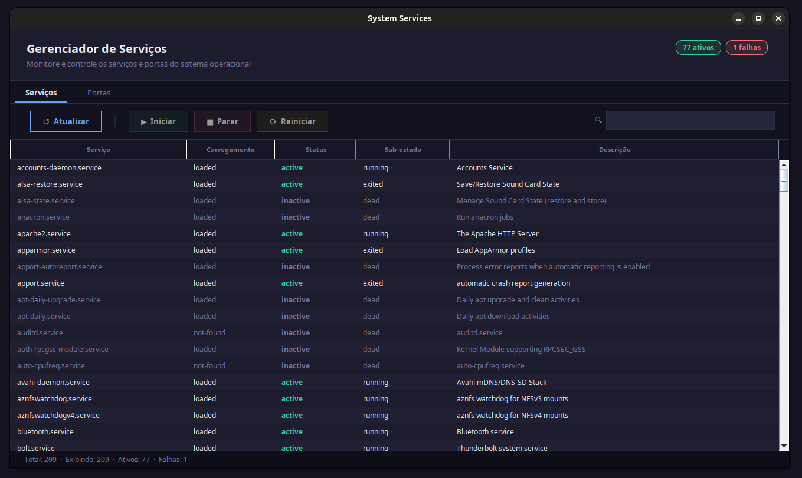

# System Services

Aplicativo desktop para Linux que permite monitorar e controlar serviços systemd e portas de rede abertas.

  



## Funcionalidades

### Aba Serviços
- Lista todos os serviços systemd (equivalente a `systemctl list-units --type=service --all`)
- Filtro em tempo real por nome, descrição ou status
- Ações de **iniciar**, **parar** e **reiniciar** com confirmação antes de executar
- Autenticação via polkit (diálogo gráfico) com fallback para `sudo`
- Chips no cabeçalho com contagem de serviços ativos e com falha
- Duplo clique abre painel de detalhes do serviço

### Aba Portas
- Lista todas as portas em escuta TCP e UDP (via `ss -tunlp`)
- Filtro por número de porta, protocolo, endereço ou nome do processo
- **Encerrar processo** vinculado à porta via SIGTERM, com confirmação
- Autenticação via polkit ou `sudo` para processos de outros usuários
- Chips com total de portas e quantidade com processo identificado
- Duplo clique abre painel de detalhes da porta

## Download

<p>
  <a href="https://github.com/edfcsx/system-services/releases/download/1.0/system-services-1.0.zip">
    
  </a>
</p>

## Pré-requisitos

| Dependência | Versão mínima | Observação |
|-------------|---------------|------------|
| Java | 17 | Instalado automaticamente pelo `install.sh` |
| systemd | qualquer | Necessário para a aba Serviços |
| iproute2 (`ss`) | qualquer | Necessário para a aba Portas |
| polkit ou sudo | qualquer | Para ações privilegiadas |

## Instalação

1. Baixe o arquivo `.zip` pelo botão acima
2. Extraia o conteúdo em qualquer diretório
3. Abra um terminal dentro da pasta extraída e execute:

```bash
chmod +x install.sh
./install.sh
```

O script verifica e instala o Java 17 automaticamente (se necessário) e registra o aplicativo no menu do sistema, na categoria **System**.

## Estrutura do Projeto

```
src/main/java/SystemServices/
├── App.java                     # Ponto de entrada
├── model/
│   ├── Service.java             # Modelo de serviço systemd
│   └── PortEntry.java           # Modelo de porta/processo
├── service/
│   ├── SystemctlCommand.java    # Wrapper para systemctl
│   └── PortsCommand.java        # Wrapper para ss e kill
└── ui/
    ├── MainWindow.java          # Janela principal, paleta de cores, abas
    ├── ServicesPanel.java       # Painel da aba Serviços
    ├── ServiceTableModel.java   # TableModel para serviços
    ├── ServiceTableRenderer.java
    ├── PortsPanel.java          # Painel da aba Portas
    ├── PortsTableModel.java     # TableModel para portas
    └── PortsTableRenderer.java
```

## Build

```bash
# Compilar e rodar testes
./gradlew build

# Apenas gerar o JAR
./gradlew jar

# Limpar artefatos
./gradlew clean
```
